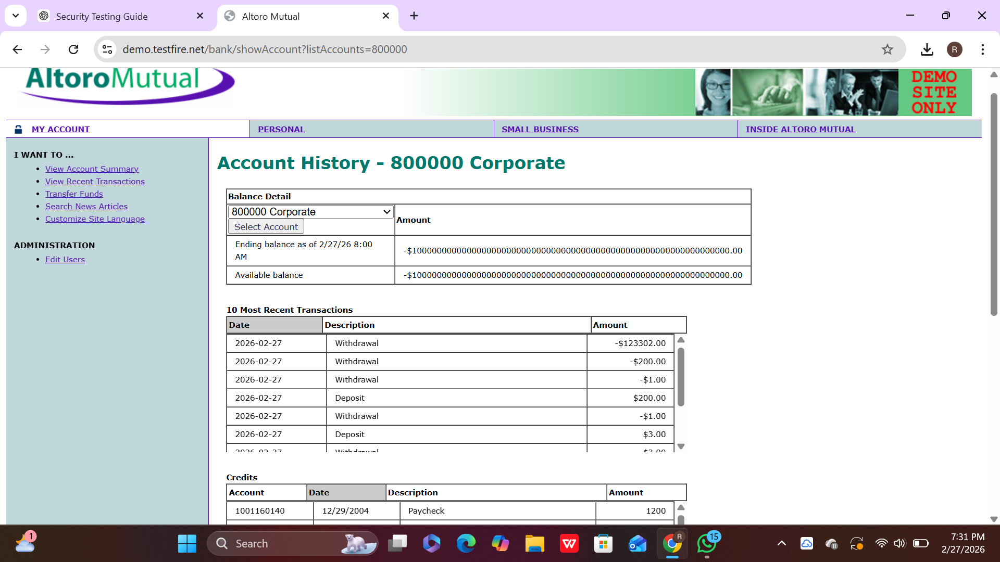
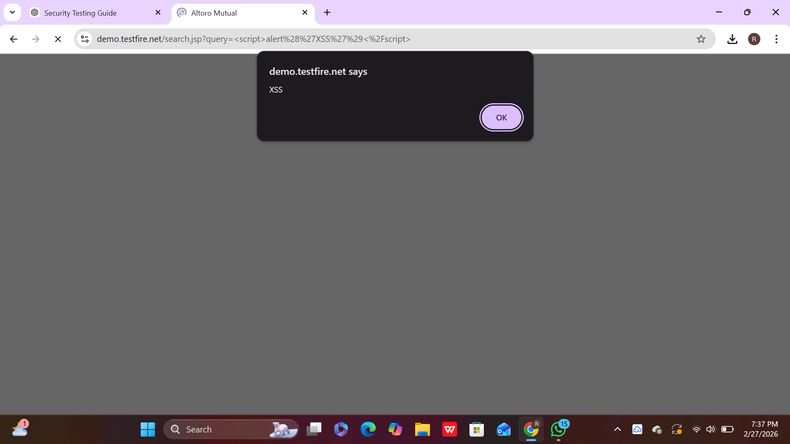
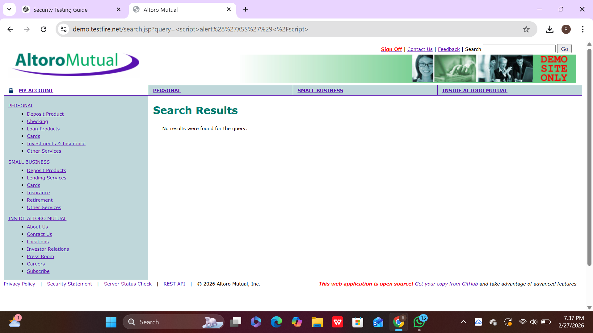

🔐 Web Application Security Testing – Task 3
CODTECH Internship

- **Company:** CODTECH IT SOLUTIONS
- **Intern Name:** Garnepudi Renuka Rani
- **Intern ID:** CTIS55575
- **Domain:** Software Testing
- **Duration:** 4 Weeks
- **Mentor:** Neela Santhosh

📌 Project Title

Web Application Security Testing

📖 Project Description

This project focuses on identifying common web application vulnerabilities through manual security testing.
The objective is to analyze weaknesses and document findings with proper evidence (screenshots).

🎯 Objectives

Identify SQL Injection vulnerabilities

Identify Cross-Site Scripting (XSS) vulnerabilities

Test input validation weaknesses

Document all findings with screenshots

🛠 Tools Used

Google Chrome

VS Code

Test Payloads

🧪 Test Cases
✅ Test Case 1: SQL Injection – Login Bypass

Test Description:
Attempted to bypass login authentication using SQL injection payload.

Payload Used:
' OR '1'='1

Expected Result:
Application should reject invalid credentials.

Actual Result:
Login bypassed successfully.

Status: ❌ Vulnerable

📷 Screenshot

## 📷 SQL Injection Test Screenshot

✅ Test Case 2: SQL Injection – Vulnerable Result Page

Test Description:
Checked whether SQL query manipulation exposes database data.

Expected Result:
Application should restrict database access.

Actual Result:
Sensitive data displayed.

Status: ❌ Vulnerable

📷 Screenshot

## 📷 SQL Injection Vulnerable Result

✅ Test Case 3: Cross-Site Scripting (XSS) – Input Field Test

Test Description:
Injected JavaScript into input fields.

Payload Used:

Expected Result:
Application should sanitize user input.

Actual Result:
Alert popup executed.

Status: ❌ Vulnerable

📷 Screenshot

## 📷 XSS Test Screenshot

✅ Test Case 4: Cross-Site Scripting (XSS) – Result Execution

Test Description:
Verified if malicious script runs on page load.

Expected Result:
Script execution should be blocked.

Actual Result:
Script executed successfully.

Status: ❌ Vulnerable

📷 Screenshot

## 📷 XSS Result Screenshot

📊 Overall Findings

The application is vulnerable to:

SQL Injection

Cross-Site Scripting (XSS)

These vulnerabilities can allow attackers to:

Bypass authentication

Access sensitive data

Execute malicious scripts

🛡 Recommendations

Use Prepared Statements

Implement Server-side Validation

Sanitize all user inputs

Apply Content Security Policy (CSP)

📂 Repository Contents

README.md

Security_Testing_Report.txt

SQLinjectiontest.png

SQLtesting_vulnerable.png

XSStest.png

XSSresults.png

📌 Conclusion

This project demonstrates the importance of secure coding practices and regular security testing to prevent cyber threats.
